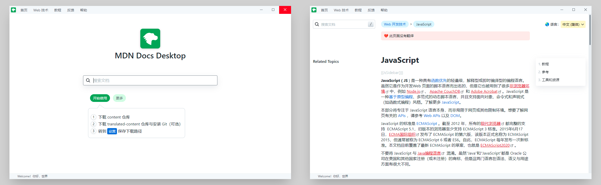

# MDN Docs Desktop

Delightful offline MDN docs viewer. And also built-in Node.js official documentation.

## Install

1. Install electron
2. Download `app.asar`

I'm too lazy to create application package for different platform, so you need to download Electron's [prebuilt binaries](https://github.com/electron/electron/releases).

Download `app.asar` from latest [releases](https://github.com/LitileXueZha/MDN-Docs-Desktop/releases), then put it into your electron install directory `resources/app`. **Make sure** your downloaded electron version is matched with the released `app.asar` required version.

Then you can try the optional step, [Customization](#customization).

Happy for using ~~~

## About

MDN web docs 是一个共建的网络学习平台，多年来一直是查询文档标准的好地方，其内容托管在 Github 仓库 [content](https://github.com/mdn/content) 和翻译仓库 [translated-content](https://github.com/mdn/translated-content) 上，主要由 Mozilla 进行托管和维护。

2022/03/01, Mozilla 发布了 [A new year, a new MDN](https://hacks.mozilla.org/2022/03/a-new-year-a-new-mdn/)，一个奇怪的 logo，糟糕体验的交互和排版设计，还有随后将会推出的 Plus 版本 😰😨😱

MDN Docs Desktop 是一个离线的文档浏览器，依赖于内容仓库，对排版和交互进行了优化。

2022/10/28 更新支持查看 Node.js 官网文档。主要是因为在写一个库的时候，频繁查文档看得都吐了，滚动滚到手抽筋，到底部了还没有 scroll-to-top，花点时间干脆直接内建本地浏览了。[预览图](docs/screenshot-nodejs-api.png)

## TODO

+ 内置搜索引擎。新建搜索窗口，使用 Google 等等的高级 `site:` 选项搜索 mdn，拦截 url 点击请求跳转应用内。
+ Related Topics 宏优化。目前该功能使用 `{{SideBar}}` 宏定义在 `yari` 仓库中，考虑使用 `.ejs` 模板引擎提取数据。
+ 版权文件
+ caniuse 兼容性。内嵌 or 提取 bcd 仓库数据？待定

## Customization

```shell
rcedit electron.exe --set-file-version "0.0.1.0"
rcedit electron.exe
    --set-icon favicon.ico
    --set-version-string "CompanyName" "litilexuezha"
    --set-version-string "FileVersion" ""
    --set-version-string "FileDescription" "MDN Docs Desktop"
    --set-version-string "LegalCopyright" "MIT License, Copyright (c) litilexuezha"
    --set-version-string "OriginalFilename" "MDN-Docs-Desktop.exe"
    --set-version-string "ProductName" "MDN Docs Desktop"
    --set-version-string "ProductVersion" ""
mv electron.exe MDN-Docs-Desktop.exe
```

### Linux

1. Rename `electron` to `mdn-docs-desktop`
2. Download `assets/mdn-web-doc.png`
3. Add `mdn-docs-desktop.desktop`

Assume your path is like this:

```
~/Downloads/electron
├── resources
│   └── app.asar
├── ...
├── mdn-docs-desktop
├── mdn-web-docs.png
```

Create a `.desktop` file in `~/.local/share/applications` or `/usr/share/applications`.

```
[Desktop Entry]
Version=1.0
Type=Application
Name=MDN Docs Desktop
Exec=/home/yourname/Downloads/electron/mdn-docs-desktop
Icon=/home/yourname/Downloads/electron/mdn-web-docs.png
MimeType=image/x-foo;
Actions=new-window

[Desktop Action new-window]
Exec=/home/yourname/Downloads/electron/mdn-docs-desktop
Name=New Window
```
